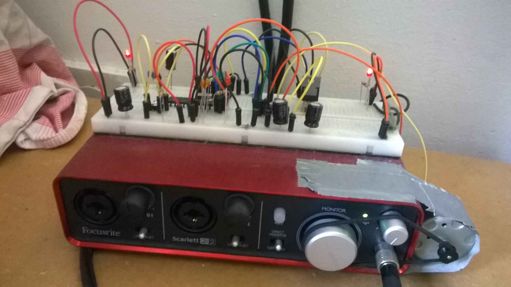
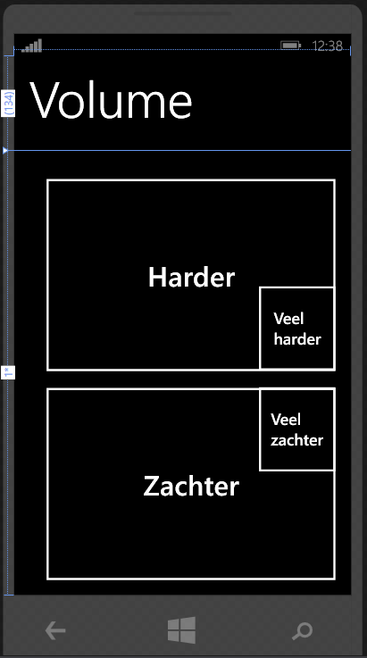
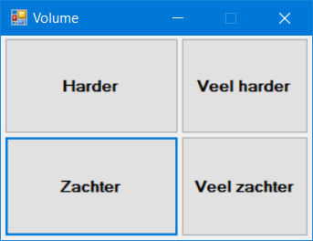

My Focusrite Scarlett 2i2 USB DAC didn't have a remote control, so I built one.

On the physical side, there is an Atmel ATMega328P microcontroller (same as in Arduino Uno) with an ENC28J60 ethernet module. The microcontroller runs a webserver on the local network.

Then there is an app for the Nokia Lumia 520 that I had at the time and a Windows (C# Winforms) app. These apps simply make web requests to the microcontroller, also over the local network. On receiving a webrequest, the microcontroller will switch the H-bridge to shortly or very shortly turn on the DC motor that is connected to the volume knob of the USB DAC.

